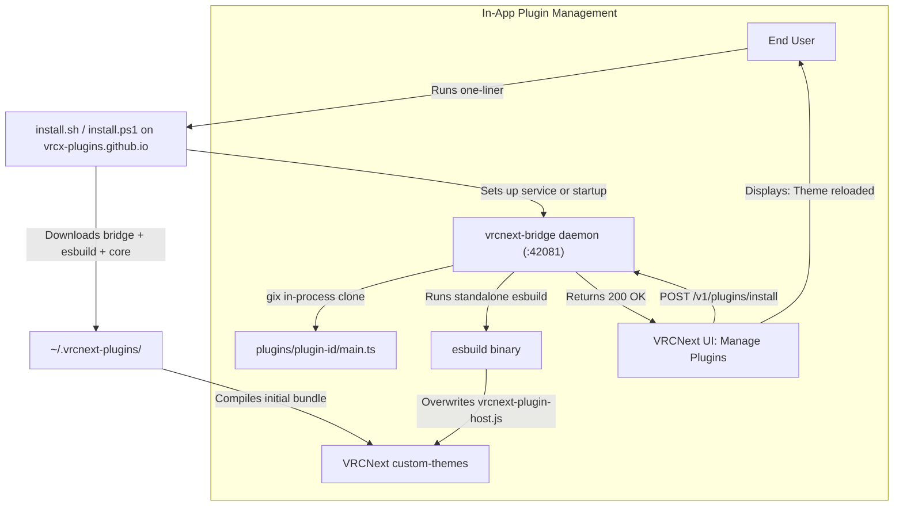

# Design: the pre-bundled plugin architecture

[← Back to index](./)

> **Historical.** This is the plan the current architecture grew from (September 2026), kept for the reasoning. Where it disagrees with the rest of this site — the install domain, IndexedDB, per-plugin details — the rest of the site is right.


## Goal Description

Transition the VRCNext Plugin System from a client-side runtime evaluation model (IndexedDB + dynamic `Blob` URLs) to an **Ahead-Of-Time (AOT) compiled monolithic bundle**.

Under this model:
1. **Zero-Dependency One-Liner Installer**:
   End-users run a clean one-liner from the base domain:
   - **Linux / macOS**: `curl -sSL https://vrcx-plugins.github.io/install.sh | bash`
   - **Windows PowerShell**: `iwr -useb https://vrcx-plugins.github.io/install.ps1 | iex`
   *(Neither Git nor Node.js is required on the user's PC!)*
2. **Pure-Rust In-Process Git Engine (`gix` / gitoxide)**:
   All Git repository cloning, branch tracking, commit verification, and updating are performed **in-process inside `vrcnext-bridge`** using the pure-Rust `gix` crate. No external `git` binary, no C-compiler/CMake (`libgit2`) dependencies, and zero command-line injection surface.
3. **Standalone Compilation Engine (`esbuild`)**:
   `vrcnext-bridge` drives a standalone static `esbuild` binary (~9 MB) located in `~/.vrcnext-plugins/bin/`. Compiles TypeScript plugins into the VRCNext custom theme in **< 30 milliseconds** without Node.js or pnpm.
4. **Flat Plugin Repositories (1 Repo = Root `main.ts`)**:
   Plugin repositories are flat: **`main.ts` directly in the repository root**, exporting `definePlugin({ ... })` (identical to Vencord's authoring model).
5. **In-App Management**:
   The VRCNext "Manage Plugins" UI communicates with `vrcnext-bridge` over local loopback (`http://127.0.0.1:42081`) to clone/pull plugin repos via `gix` and compile the unified bundle.

---

## Security Analysis: Pure-Rust `gix` vs CLI Spawning

> [!NOTE]
> **Summary on Security**: Using `gix` (gitoxide) eliminates command-line injection and argument injection entirely by keeping all Git network and repository operations inside Rust memory.

### 1. Complete Elimination of CLI & Argument Injection
- **Shell Injection**: Completely impossible. No shell (`/bin/sh`, `cmd.exe`) is ever spawned.
- **Git Option / Flag Injection**: Completely impossible. In traditional CLI spawning, malicious inputs like `--upload-pack="cmd"` or `ext::sh -c ...` exploit `git`'s command line parser. With `gix`, repository operations use structured Rust structs and in-memory function calls (`gix::prepare_clone(...)`), so command-line options do not exist.
- **Path Traversal Protection**: Target directories are resolved within `~/.vrcnext-plugins/plugins/` using sanitized, canonicalized alphanumeric names (`[a-zA-Z0-9_-]+`), preventing directory traversal.

### 2. Supply-Chain & State Predictability
- Plugins are cloned at explicit Git commits/tags on the local filesystem.
- Eliminates dynamic `Blob` URLs (`URL.createObjectURL`) and runtime code evaluation (`import(blobUrl)`).
- Source code is plainly visible and auditable under `~/.vrcnext-plugins/plugins/<plugin-id>/main.ts`.

### 3. Remaining Considerations
- **Runtime Authority**: Plugins bundled into `vrcnext-plugin-host.js` execute within the VRCNext DOM/Photino context with standard client permissions. Static analysis/linting during bundling can flag dangerous calls like `eval()`.

---

## Ecosystem Comparison

| Dimension | Equicord / Vencord | Our Planned VRCNext Model |
| :--- | :--- | :--- |
| **Normal Users** | Downloads pre-compiled release bundle (`dist.zip`). Cannot add unmerged 3rd-party git plugins. | Can install any 3rd-party plugin Git repo via UI; `vrcnext-bridge` automatically compiles it locally in <30ms. |
| **Custom Git Plugins** | Requires **Node.js + pnpm** installed on user PC. Runs `pnpm build --dev` via `child_process.exec`. | **Zero Node.js dependency**: Spawns standalone static `esbuild` binary. |
| **Git Dependency** | Requires system `git` in PATH. | **Zero Git dependency**: Uses pure-Rust **`gix`** in `vrcnext-bridge`. User does not need `git.exe` installed. |
| **Plugin Authoring** | Flat `index.ts` exporting `definePlugin({ ... })`. | Flat `main.ts` directly in repo root exporting `definePlugin({ ... })`. |

---

## Architecture Flow



---

## Proposed Changes

### Component 1: Cross-Platform Unified Installer (No Node, No Git Required)

#### [NEW] `vrcnext-plugin-system/scripts/installer/install.sh`
- Minimal, POSIX-compliant installer for Linux & macOS.
- Prerequisites: only `curl` and `tar` (built into all Linux/macOS systems).
- Downloads:
  1. `vrcnext-bridge` pre-compiled binary (Linux x86_64 / aarch64) to `~/.local/bin/vrcnext-bridge`.
  2. Standalone static `esbuild` binary to `~/.vrcnext-plugins/bin/esbuild`.
  3. `vrcnext-plugin-system` core release archive to `~/.vrcnext-plugins/core/`.
- Configures `~/.config/VRCNext/settings.json` with `"LocalHttpPort": 42081`.
- Enables and starts `vrcnext-bridge.service` via `systemctl --user`.
- Triggers initial build: creates `~/.config/VRCNext/custom-themes/vrcnext-plugin-system/vrcnext-plugin-host.js`.

#### [NEW] `vrcnext-plugin-system/scripts/installer/install.ps1`
- Windows PowerShell one-liner for Windows VRCNext users.
- Zero external package requirements (uses PowerShell native `Invoke-WebRequest` and `Expand-Archive`).
- Downloads Windows `vrcnext-bridge.exe`, `esbuild.exe`, and core files into `%USERPROFILE%\.vrcnext-plugins\`.
- Registers `vrcnext-bridge` in Windows Startup (or Task Scheduler).
- Configures `%APPDATA%\VRCNext\settings.json` and compiles initial custom theme bundle.

---

### Component 2: Native Companion (`vrcnext-bridge`) with In-Process `gix`

#### [MODIFY] `vrcnext-bridge/Cargo.toml`
Add `gix` dependency with blocking HTTP/reqwest-rustls features:
```toml
gix = { version = "0.72", default-features = false, features = ["blocking-http-transport-reqwest-rustls", "revision"] }
url = "2"
```

#### [NEW] `vrcnext-bridge/crates/vrcnext-bridge-plugins`
Dedicated sub-crate in `vrcnext-bridge` handling plugin lifecycle & bundling:
- **`GitService` (powered by `gix`)**:
  - `clone_plugin(repo_url: &str, target_dir: &Path) -> Result<PluginInfo, PluginError>`:
    - Parses URL with `url::Url`, ensures `https` (or localhost `http`).
    - Uses `gix::prepare_clone(url, target_dir)` to clone shallow commit into `~/.vrcnext-plugins/plugins/<id>/`.
    - Verifies presence of `main.ts` (or `main.js` / `index.ts`).
  - `check_updates() -> Result<Vec<PluginUpdateInfo>, PluginError>`:
    - Opens each installed plugin repo via `gix::open`.
    - Performs an in-memory `fetch` of remote tracking references without modifying the working tree.
    - Calculates commit divergence (`local..upstream`).
    - Returns structured changelog if upstream has new commits:
      - `has_update: bool`
      - `commits_behind: usize`
      - `current_commit: String`
      - `latest_commit: String`
      - `changelog: Vec<CommitSummary>` (short hash, subject line, author, date).
  - `pull_plugin(plugin_dir: &Path) -> Result<UpdateStatus, PluginError>`:
    - Opens repo via `gix::open(plugin_dir)`.
    - Fast-forwards working tree and HEAD to latest remote commit.
  - `list_installed() -> Result<Vec<InstalledPluginInfo>, PluginError>`:
    - Iterates over `plugins/` directories, reads HEAD commit hash and remote origin URL using `gix`.
- **`BuildService`**:
  - Scans `plugins/*/main.ts`.
  - Generates virtual entry table linking all plugins.
  - Invokes `~/.vrcnext-plugins/bin/esbuild` with `--bundle --minify --format=iife --outfile=<theme_path>`.
  - Typical build duration: **15 - 25ms**.

#### [MODIFY] `vrcnext-bridge/crates/vrcnext-bridge-server`
Expose HTTP endpoints on port 42081:
- `POST /v1/plugins/install`: Clones repo via `gix` and re-bundles.
- `GET /v1/plugins/check-updates`: Runs in-memory `fetch` via `gix` across all repos and returns update availability + changelog list.
- `POST /v1/plugins/update`: Pulls via `gix` and re-bundles (supports updating single plugin by id or all).
- `DELETE /v1/plugins/uninstall`: Deletes plugin folder and re-bundles.
- `GET /v1/plugins/list`: Returns list of installed plugins with git info.

---

### Component 3: Build & Static Plugin Linking Pipeline

#### [NEW] `vrcnext-plugin-system/packages/host/src/static-plugins.ts`
- Generated/linked at bundle time:
  ```ts
  import plugin_osc_control from '../../plugins/vrcnext-osc-control/main.ts';
  import plugin_chat_box from '../../plugins/vrcnext-chat-box/main.ts';

  export const COMPILED_PLUGINS = [
    plugin_osc_control,
    plugin_chat_box,
  ];
  ```
- Integrates with topological dependency ordering (`orderPluginsByDependency`), settings schemas, and lifecycle management.

---

### Component 4: Web UI Updates

#### [MODIFY] `vrcnext-plugin-system/packages/host/src/ui/manager-panel.ts`
- Add Plugin input accepts Git URL (`https://github.com/user/plugin-repo`).
- Calls `vrcnext-bridge` (`/v1/plugins/install`).
- Shows live step-by-step progress:
  - *"Connecting to repository..."*
  - *"Cloning via gix engine..."*
  - *"Compiling monolithic bundle with esbuild..."*
  - *"Ready! Bundle updated."*
- **"Check for Updates" Button**:
  - Queries `GET /v1/plugins/check-updates`.
  - When updates are found:
    - Badges the plugin card with an accent pill: *"Update Available (2 new commits)"*.
    - Displays expandable commit log showing what's new (commit hashes, commit subjects, authors).
    - Provides a one-click *"Update"* button per plugin and an *"Update All"* batch button.

---

## Verification Plan

### Automated Tests
1. **`gix` Clone & Pull Tests**:
   - Unit tests in `vrcnext-bridge-plugins` testing `clone_plugin`, `pull_plugin`, and URL validation with mock/local repositories.
   - Test rejection of invalid schemes (`file://`, `ssh://`, `ext::`).
2. **Bundler Engine Tests**:
   - Integration test running `esbuild` against 0, 1, and multiple mock `main.ts` plugins to confirm correct IIFE bundle generation.
3. **Host Test Suite**:
   - Ensure all 71 existing unit tests in `vrcnext-plugin-system` pass via `./scripts/check.sh`.

### Manual Verification
1. Run `install.sh` on `blu-pc-bazzite`.
2. Verify `vrcnext-bridge` starts and serves `/v1/plugins/list`.
3. In VRCNext UI, paste a sample plugin GitHub URL.
4. Verify `vrcnext-bridge` clones via `gix` into `~/.vrcnext-plugins/plugins/` and compiles `vrcnext-plugin-host.js` in <50ms.
5. Reload theme and verify the plugin activates immediately.
